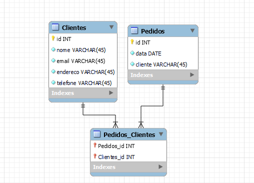

# Sistema de pedidos

## Sistema de Gerenciamento de Pedidos

Criando o banco

    create database gerenciadorpedidos;

## Criando tabelas e inserindo dados

Tabela clientes.

    create table clientes(
    id int auto_increment primary key,
    nome varchar(50),
    email varchar(50),
    telefone varchar(50),
    endereco varchar(50)
    );

Inserindo dados a tabela clientes

    insert into clientes (nome, email, telefone, endereco)values
    ('Ricardo','ricardo@gmail.com', '(15)99331-2213','rua Tabajaré'),
    ('Douglas','douglas@gmail.com','(15)98119-6654','rua Ganso'),
    ('Mari', 'mari@gmail.com', '(15)98871-2332', 'rua das Nascentes');

Criando tabela pedidos

    create table pedidos(
    id int auto_increment primary key,
    data_pedido date,
    valor decimal(9,2),
    cliente_id int,
    foreign key (cliente_id) references clientes(id)
    );

Inserindo dados a tabela pedidos

    insert into pedidos (data_pedido, valor, cliente_id) values
    ('2023-01-02', 300.00, 1),
    ('2023-02-15',100.50, 2),
    ('2023-09-08', 400.10, 3);

## Criando Stored Procedure

DELIMITER $$

    create procedure InserirPedido(
    in cliente_id int ,
    in data_pedido date,
    in valor decimal(9,2)
    )
    begin
    	insert into pedidos(cliente_id, data_pedido, valor) values
    	(cliente_id, data_pedido, valor);
    end$$

DELIMITER ;

call InserirPedido(4,'2023-05-05',50.00);

select \* from pedidos;

## Criando Trigger

Criando uma coluna na tabela cliente chamada "TotalPedidos"

    ALTER TABLE clientes ADD TotalPedidos DECIMAL(9, 2) DEFAULT 0;

Criando a Trigger

    DELIMITER $$
    create trigger AtualizaTotalPedidos
    after insert on pedidos
    for each row
    begin
    	update clientes
    	set TotalPedidos = TotalPedidos + new.valor
    	where id = new.cliente_id;
    end$$
    DELIMITER ;

Inserindo dados para testar o trigger:

    INSERT INTO Pedidos (cliente_id, data_pedido, valor)
    VALUES (2, '2023-11-11', 60.00);

select \* from clientes;

## Criando a View

    create view PedidosClientes as
    select
    clientes.nome,
    pedidos.valor,
    pedidos.data_pedido,
    pedidos.cliente_id
    from clientes
    inner join pedidos
    on clientes.id = pedidos.cliente_id;
